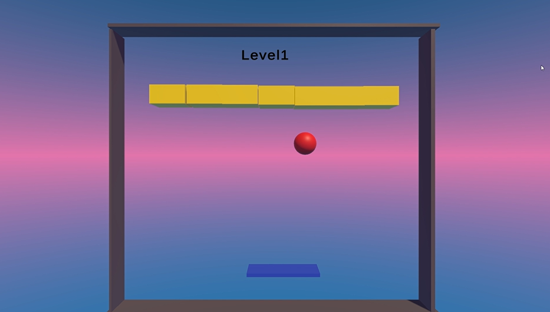
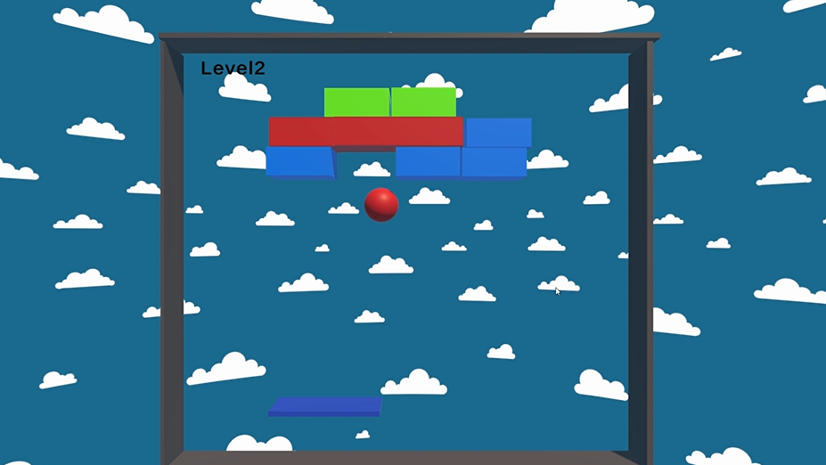
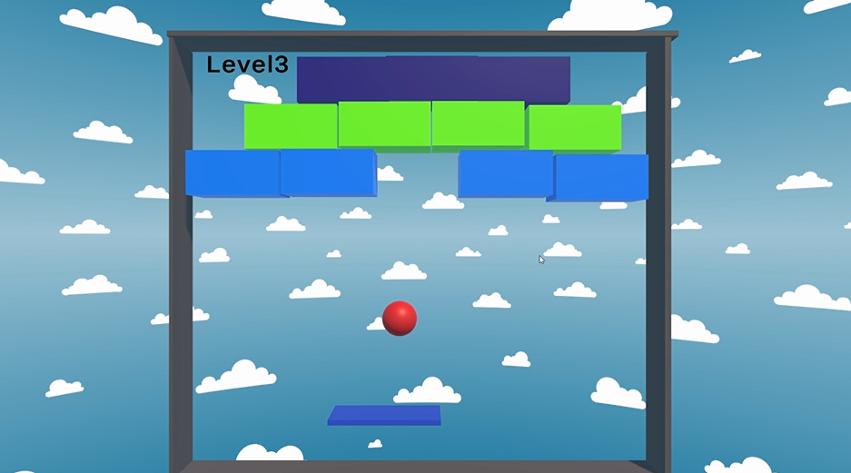
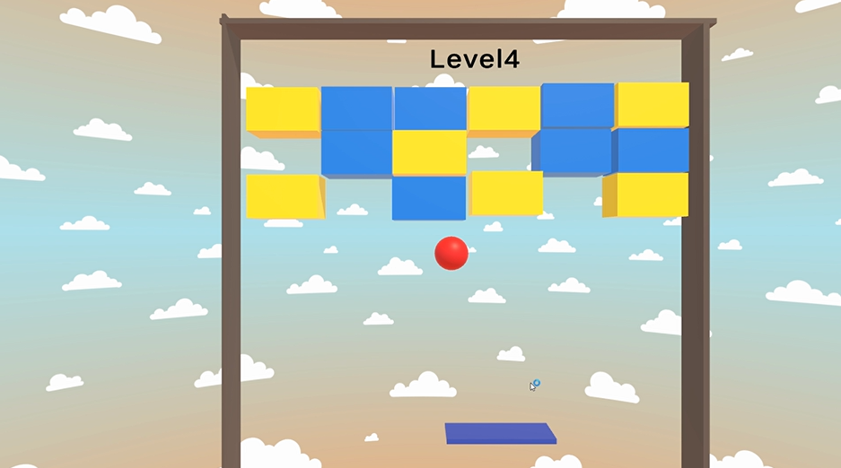
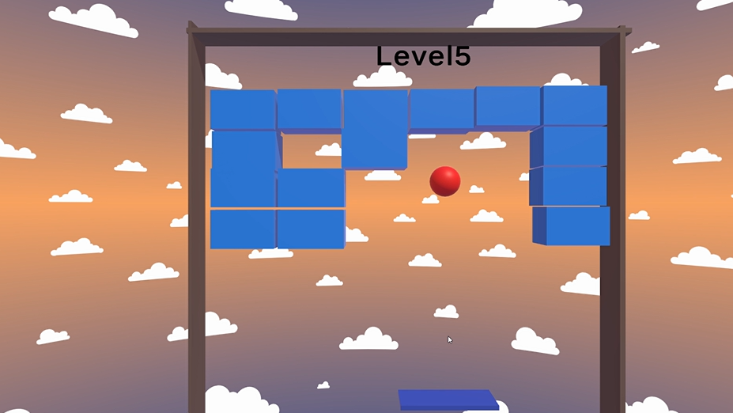
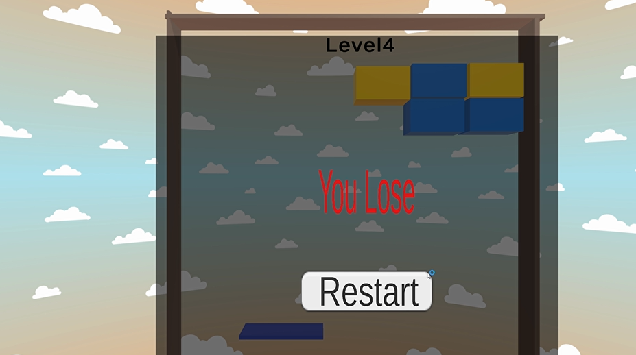

# 🎮 My First 3D Unity Game

Welcome to my first 3D game developed with Unity!  
This project was created from scratch using Unity and C#.  
This project reflects my journey as a game developer, combining creativity and technical skills to build an interactive experience.
Explore, play, and enjoy the game world I built! 🎮✨

# 🧠 About the Game
This is friendly 3D game developed using Unity. It includes:
- Interactive gameplay
- Basic 3D environments and assets
- Smooth user experience
- Developer: Yara Al-Refaei 👩‍💻
- Role: Solo Developer (Game Design, Logic, UI, and Programming)
  
# Features:
- **3D environments**
- **Interactive objects and actions**
- **User-friendly controls**
  
# This game includes:
- Multiple levels
- Win/Lose screens
- Fun gameplay and challenges

# 📦 Download and Play

👉 [Click here to download the game via Google Drive](https://drive.google.com/file/d/1hQrJXFvJiu2Oi7bfkLpqjmSGjUVexSNJ/view?usp=sharing)

> 🔹 After downloading:
1. Extract the ZIP file.
2. Inside the folder, **you must have**:
- `myFirstProject_3D.exe`
- **Do NOT remove or rename the folder**,
4. Double-click the `myFirstProject_3D.exe` file to start the game.

> ⚠️**Important:** The game won’t run if the Data folder is moved or renamed.Keep the folder and `.exe` together in the same location.

# 📸 Game Screenshots

## 🧭 Level Start

## 🧭 Leve2 Start

## 🧭 Leve3 Start

## 🧭 Leve4 Start

## 🧭 Leve5 Start

## 🏆 Winner Screen

## ❌ Lose Screen

---

## 💡 Note

This is a portfolio-level project and intended to demonstrate game development skills! ⭐  
Feel free to try the game and share your feedback! ⭐  

